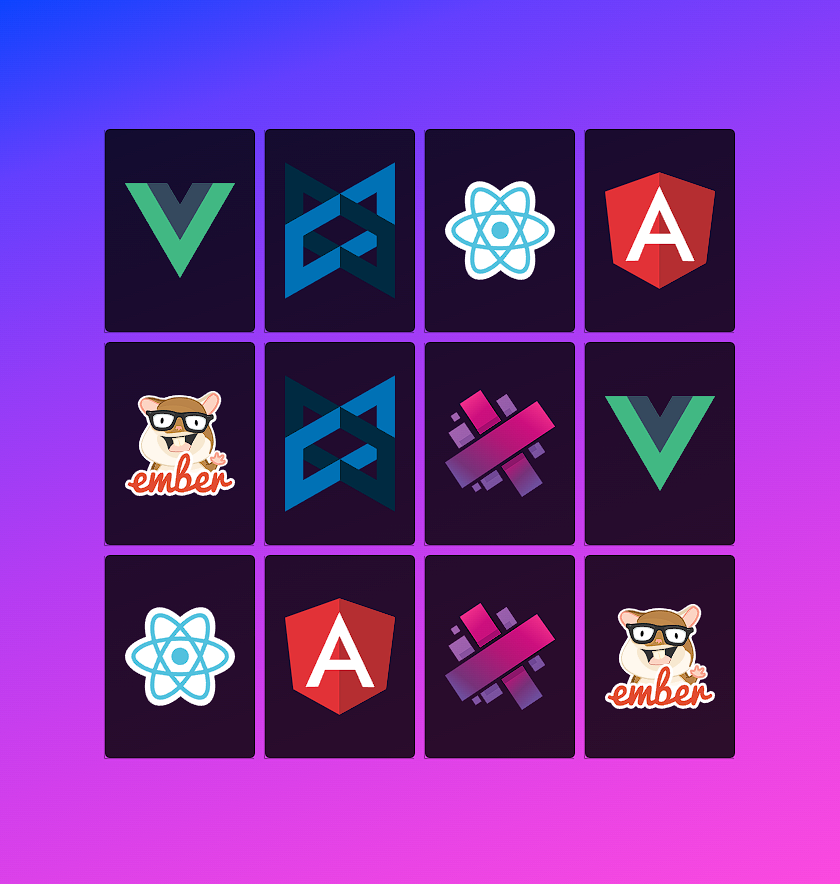

# Jogo da Memória

## Descrição
O Jogo da Memória é uma versão digital do clássico jogo de memória, onde o jogador deve encontrar todos os pares de cartas correspondentes. Este projeto foi desenvolvido como parte do meu aprendizado em desenvolvimento web.

## Funcionalidades Principais
- Tabuleiro com cartas embaralhadas.
- Virar cartas para revelar seus símbolos.
- Encontrar todos os pares de cartas correspondentes.
- Sistema de pontuação baseado no tempo e no número de movimentos.
- Interface simples e intuitiva.

## Tecnologias Utilizadas
- HTML5
- CSS3 (com pré-processador SASS/SCSS)
- JavaScript

## Como Jogar
1. Abra o arquivo `index.html` em seu navegador web.
2. Clique em uma carta para revelar seu símbolo.
3. Clique em outra carta para tentar encontrar o par correspondente.
4. Continue até encontrar todos os pares de cartas.

## Autor
Angelo Hervis
- GitHub: [AngeloHervis](https://github.com/AngeloHervis)
- LinkedIn: [Angelo Hervis](https://www.linkedin.com/in/angelohervis/)